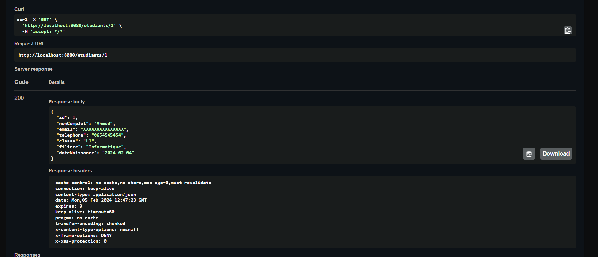
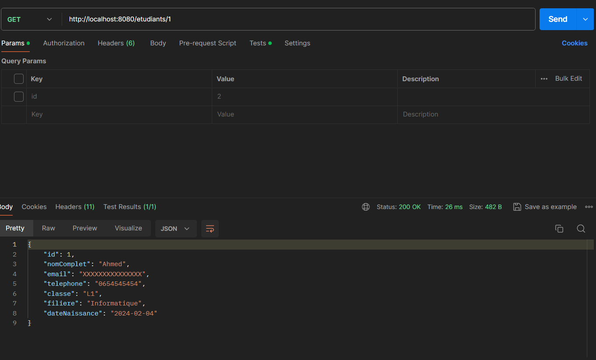
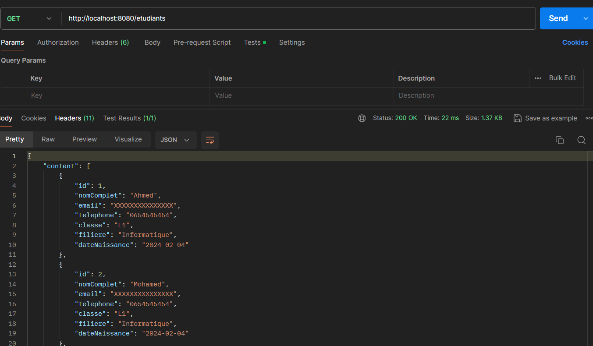
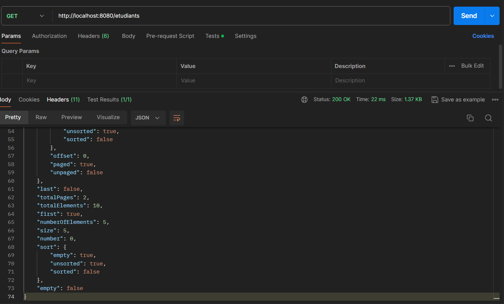
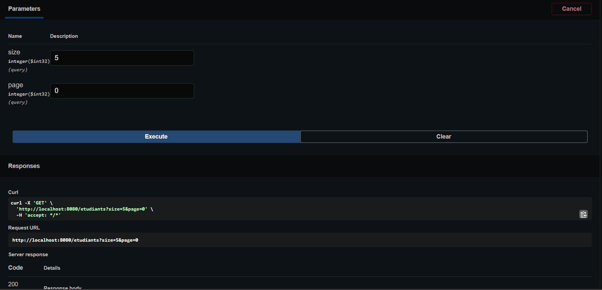

ETUDIANT CRUD WITH SPRING BOOT
 
ce projet permet l'ensemble des opérations de base sur un étudiant

lancez le projet via l'url 
    `http://localhost:8080`

La documentation est disponible sur

    http://localhost:8080/swagger-ui/index.html#/
Le schéma de génération est disponible sur     

    http://localhost:8080/api-docs

### Get Etudiant by ID

`http://localhost:8080/etudiants/1`

### POST création d'un nouveau étudiant

### GET liste etudiant paginated

Par défaut la pageSize est à 5 l'index est de 0
Les paramètres `size` et `page` sont des query params modifiables

`http://localhost:8080/etudiants?size=3&page=1`

Voici les informations retournées 

    {
    "content": [
    {
    "id": 1,
    "nomComplet": "Ahmed",
    "email": "XXXXXXXXXXXXXXX",
    "telephone": "0654545454",
    "classe": "L1",
    "filiere": "Informatique",
    "dateNaissance": "2024-02-04"
    },
    {
    "id": 2,
    "nomComplet": "Mohamed",
    "email": "XXXXXXXXXXXXXXX",
    "telephone": "0654545454",
    "classe": "L1",
    "filiere": "Informatique",
    "dateNaissance": "2024-02-04"
    },
    {
    "id": 3,
    "nomComplet": "Ahmed",
    "email": "XXXXXXXXXXXXXXX",
    "telephone": "0654545454",
    "classe": "L1",
    "filiere": "Informatique",
    "dateNaissance": "2024-02-04"
    },
    {
    "id": 4,
    "nomComplet": "Mohamed",
    "email": "XXXXXXXXXXXXXXX",
    "telephone": "0654545454",
    "classe": "L1",
    "filiere": "Informatique",
    "dateNaissance": "2024-02-04"
    },
    {
    "id": 6,
    "nomComplet": "Mohamed",
    "email": "XXXXXXXXXXXXXXX",
    "telephone": "0654545454",
    "classe": "L1",
    "filiere": "Informatique",
    "dateNaissance": "2024-02-04"
    }
    ],
    "pageable": {
    "pageNumber": 0,
    "pageSize": 5,
    "sort": {
    "empty": true,
    "unsorted": true,
    "sorted": false
    },
    "offset": 0,
    "paged": true,
    "unpaged": false
    },
    "last": false,
    "totalPages": 2,
    "totalElements": 10,
    "first": true,
    "numberOfElements": 5,
    "size": 5,
    "number": 0,
    "sort": {
    "empty": true,
    "unsorted": true,
    "sorted": false
    },
    "empty": false
    }
